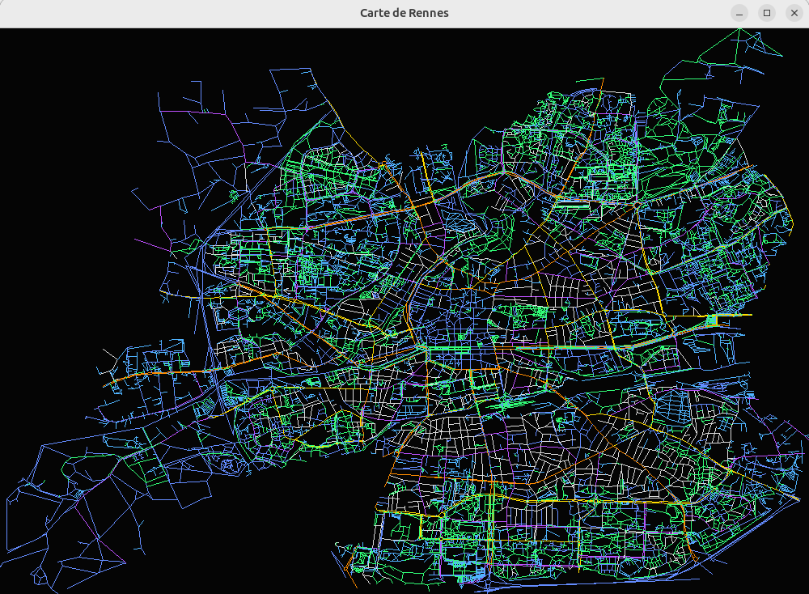
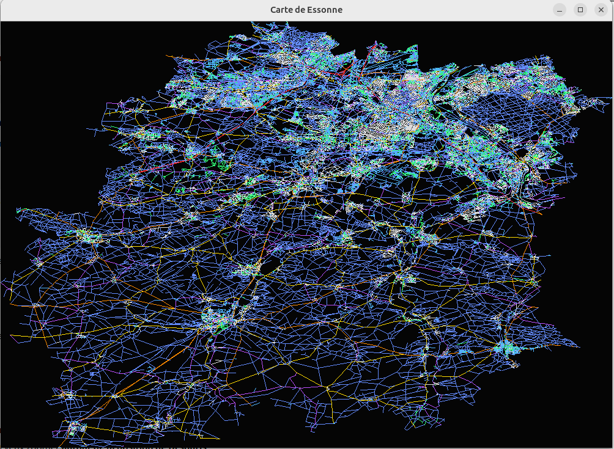

Cartographie

Projet réalisé en OCaml dans le cadre de la prépa.

Le but du projet est de charger des données provenant d'OpenStreetMap et de représenter graphiquement le réseau routier d'une ville ou d'un département.

*Exemple avec la carte de Rennes.*

*Exemple avec la carte du département de l'Essonne.*

Structure du projet :

Cartographie/
├── Node.ml / Node.mli
├── Edge.ml / Edge.mli
├── Maps.ml
├── Maps2.ml
├── Maps3.ml
├── Maps4.ml
├── city_maps/
├── department_maps/
├── images/
│   ├── rennes.png
│   └── essonne.png
└── Makefile

Node s'occupe des nœuds et de leurs coordonnées.
Edge s'occupe des routes et des informations qui leur sont associées.
Maps4.ml est actuellement le programme principal qui permet d'afficher les cartes.
city_maps contient les données des villes.
department_maps contient les données des départements.Le programme va chercher les fichiers dans department_maps

Améliorations prévues

Le projet peut encore évoluer avec notamment :

ajouter un zoom ;
pouvoir se déplacer sur la carte ;
calculer un itinéraire entre deux points;
Ajouter une légende pour les couleurs;
Trouver une rue précis;
